# 🧠 TaskFlow — The Ultimate Django To-Do App

**TaskFlow** isn’t just a to-do list.  
It’s a full-featured, production-quality task manager built with **Django + PostgreSQL**, designed to show off **clean architecture, modern UI, and professional UX**.

This project proves I can build real software — not just scripts, but secure, scalable, beautifully structured applications that matter.

---

## 🚀 What Makes This Special?

- 🔐 **Authentication & Authorization**  
  Secure login, logout, and password change using Django's built-in system — but styled my way.

- 🎨 **Fully Themed UI**  
  Light/dark mode toggle that remembers your choice, styled with Bootstrap 5.3.

- 🧭 **Modern UX**  
  Success messages, auto-dismiss alerts, intuitive navigation — everything you'd expect from a polished SaaS app.

- 📝 **Smart Task Management**  
  Create, edit, filter by priority, search by text, and track what’s done.

- 🧼 **Custom Error Pages (with style)**  
  403, 404, and 500 — all with friendly messages and memes, because users deserve it.

- 🧍 **User Control**  
  View your profile. Change your password. Even delete your account. You're in control.

---

## 🖼 Preview (Screenshots)

| 💡 Light Mode | 🌙 Dark Mode |
|--------------|-------------|
| 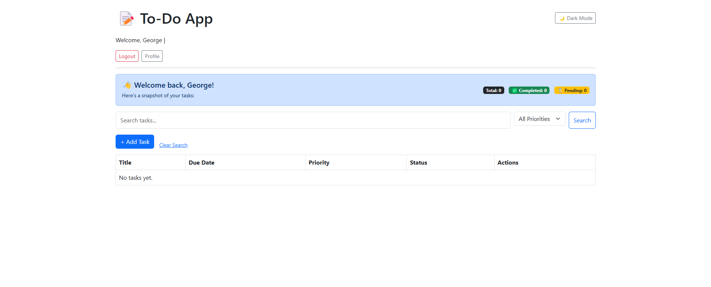 | 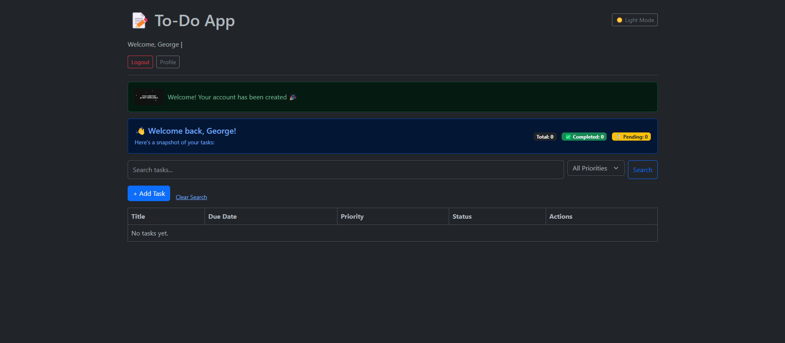 |
| 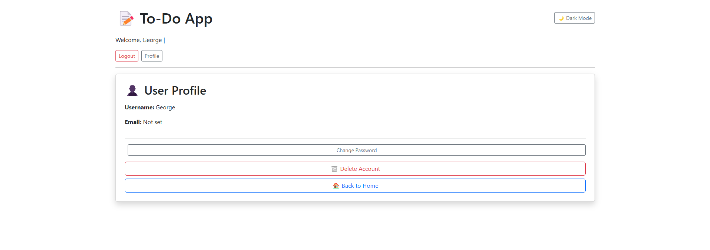 | 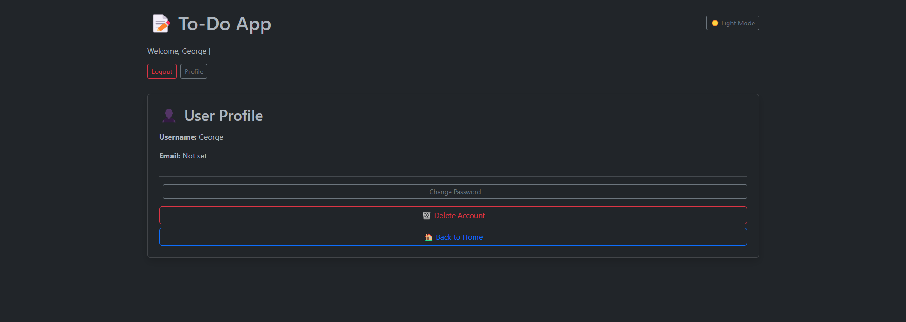 |
| 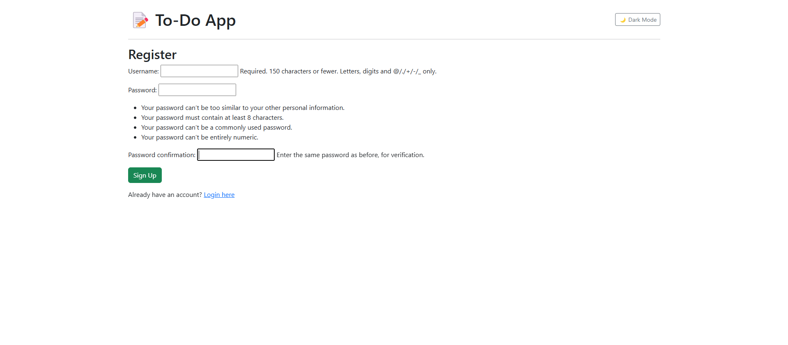 | 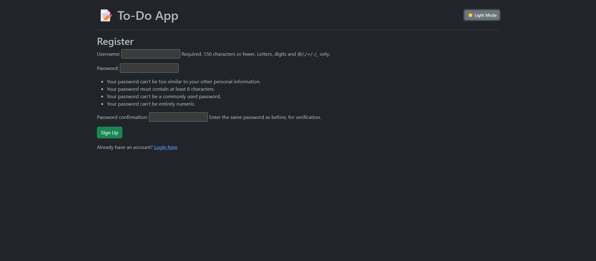 |
| 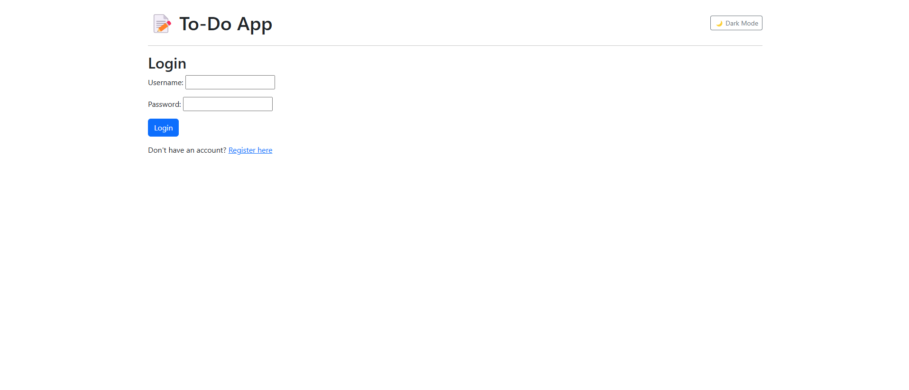 | 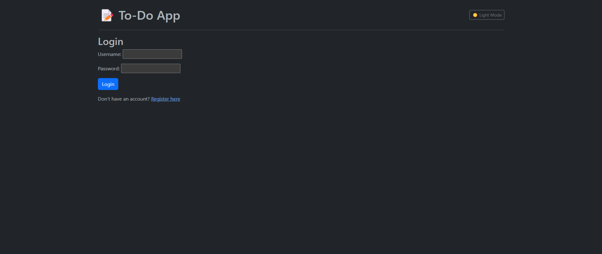 |
| 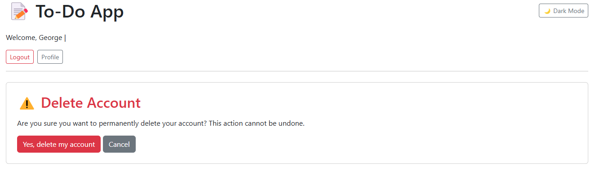 | 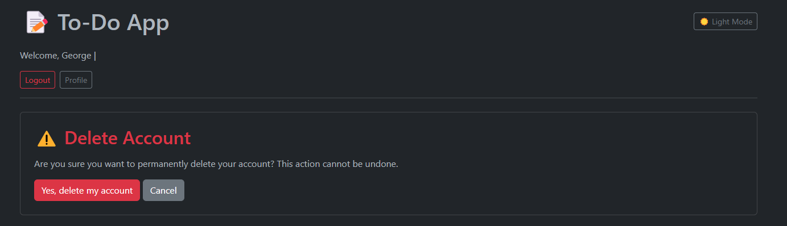 |
| 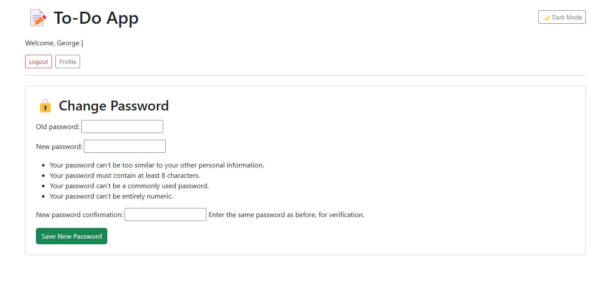 | 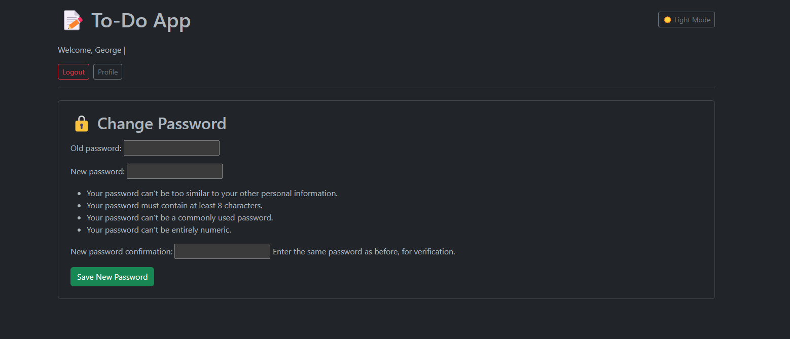 |
| 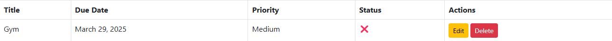 | 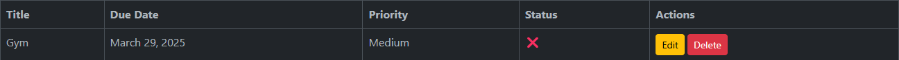 |
| 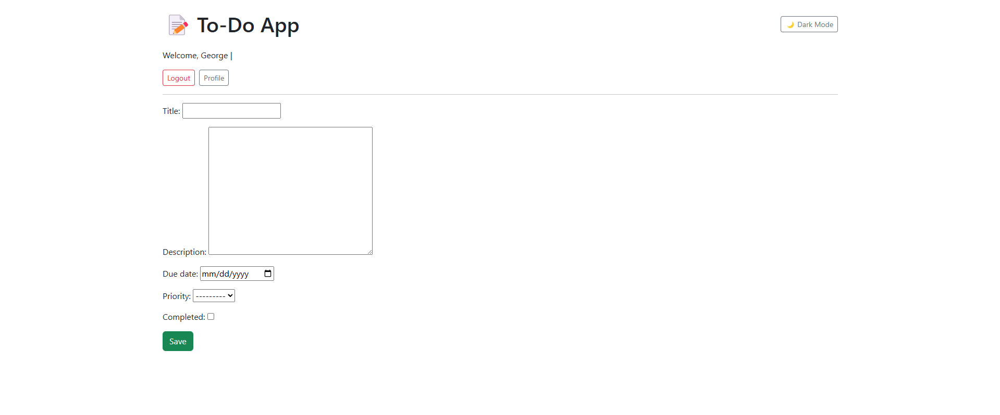 | 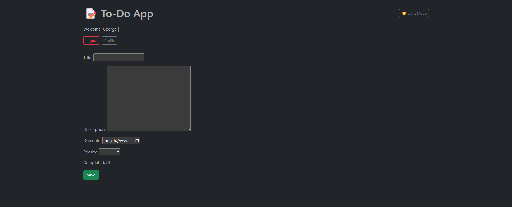 |
| 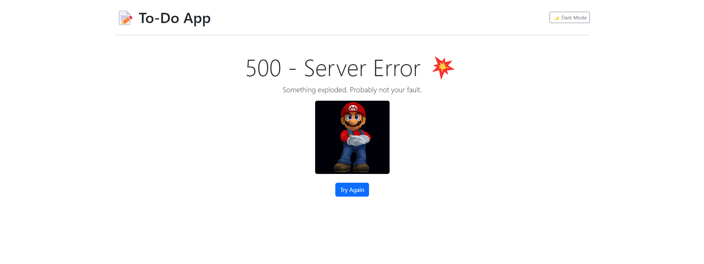 | 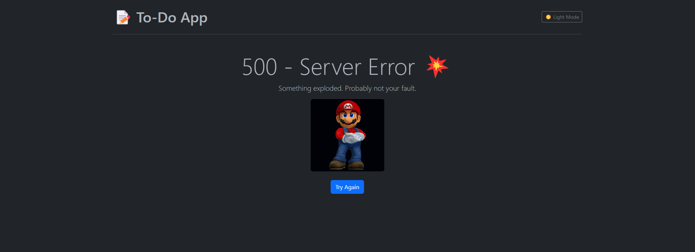 |
| 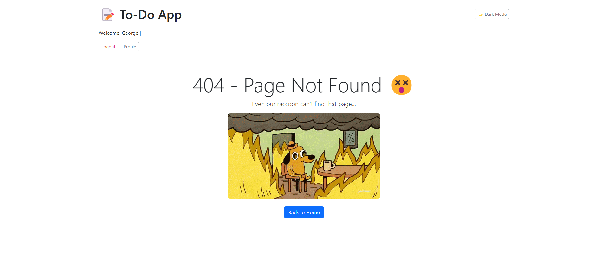 | 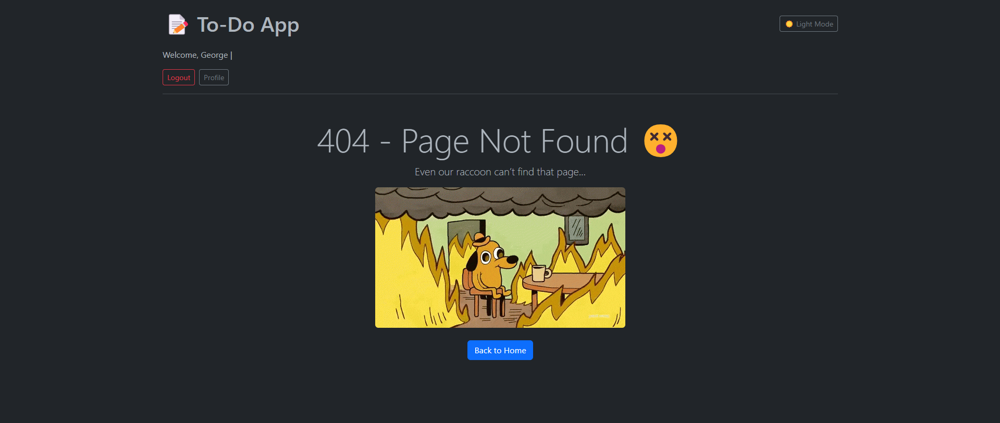 |
| 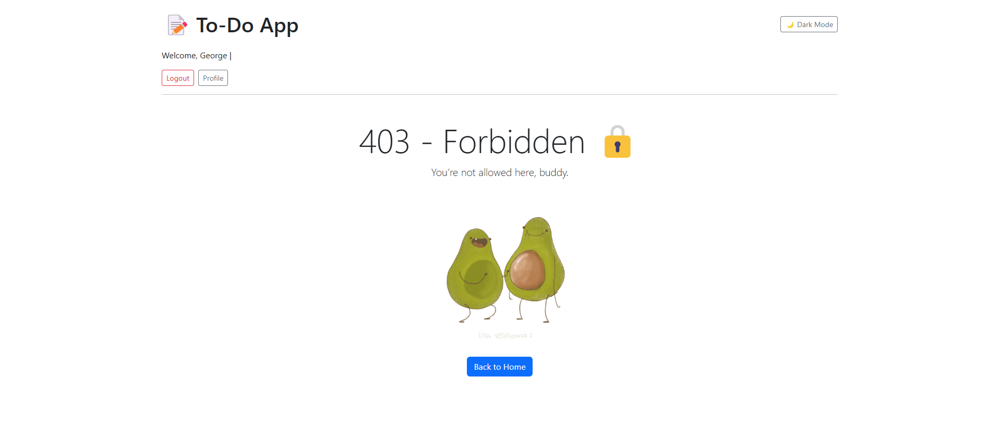 | 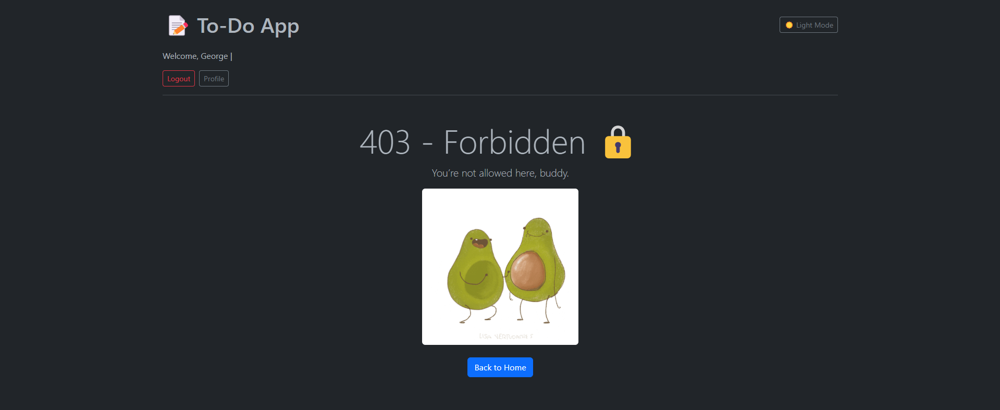 |

---

## 🛠 Tech Stack

- **Backend**: Django 5.1
- **Database**: PostgreSQL
- **Frontend**: HTML, Bootstrap 5.3, Vanilla JS
- **Auth**: Django’s battle-tested system
- **Deployment**: Ready for Render / Railway / Heroku

---

## 🎯 Project Highlights

- ✅ Built completely from scratch using Django — no templates, no shortcuts.
- 🔄 Handles full task lifecycle: create, update, complete, delete.
- 🧠 Dynamic light/dark theme toggle using localStorage (remembers your vibe).
- 🔐 Covers full auth cycle: register, login, logout, password change, delete account.
- 🎨 Clean UI with Bootstrap 5.3, styled with care and consistency.
- 🗃️ Smart task filters: search by text, filter by priority.
- 🧹 Custom 403/404/500 pages — even errors feel nice.
- 📊 Simple productivity dashboard showing total, completed, and pending tasks.

---

## 🧠 Why I Built This

I didn’t just want to follow a Django tutorial — I wanted to **create something real**.  
Something that looks and feels like a professional app.  
Something that shows I care about **structure, user experience, clean code, and polish**.

This isn’t just a to-do app. It’s proof that I can take an idea and ship it with full-stack thinking, style, and purpose.

---

## 📚 What I Learned

- ⚙️ How to build and structure real Django projects using best practices.
- 👤 How to customize Django’s built-in auth for modern flows and forms.
- 📬 How to work with messages, redirects, and success feedback like a pro.
- 🎨 How to build dynamic, responsive UIs with Bootstrap + Vanilla JS.
- 🛠️ How to manage multiple templates, template inheritance, and error handling.
- 🧭 How to think like a user — not just a developer.

---
## 💡 Ideas for the Future

- 📅 Calendar View for tasks
- 📥 CSV Export & Import
- 🧩 Subtasks & checklists
- ⏰ Email reminders for due dates
- 🚀 Dockerized & Production-ready deployment
- 📲 Progressive Web App (PWA) version
- 🌍 Multi-language support (e.g. English + Greek 🇬🇷)

---

## 🧑‍💻 Built With Love by Igli Hamati

> 💬 “I don’t just code to make things work — I code to make things feel *right*.”

📍 Junior Data Analyst | Software Developer in Progress  
📬 Contact: [ihamati@nyc.gr](mailto:ihamati@nyc.gr)  
🔗 GitHub: [@TeddyDaps](https://github.com/TeddyDaps)

---

## 🪪 License

This project is free to use and modify for learning or portfolio purposes.

